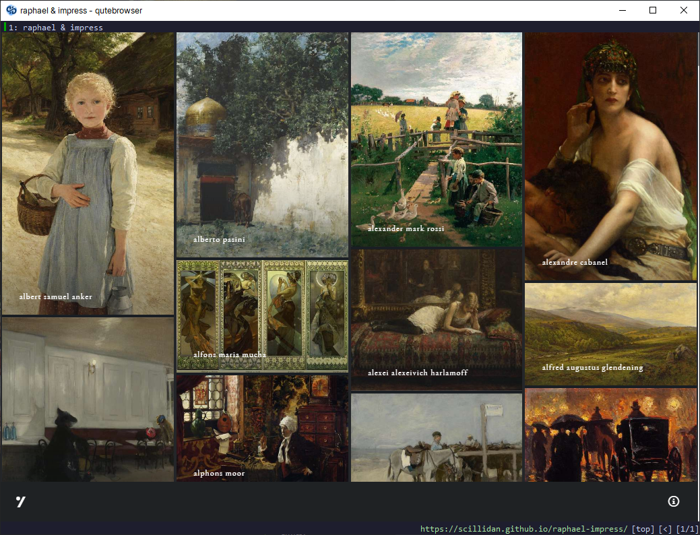

# raphael-impress

build with [AutoPhugo](https://github.com/kc0bfv/autophugo)

## Tools

- [Directory Opus](https://www.gpsoft.com.au)
- [Ditto](https://ditto-cp.sourceforge.io)
- [exiftool](https://exiftool.org)
- [ExifCleaner](https://exifcleaner.com)
- [mkdirs](https://github.com/dolanor/mkdirs)
- [feel](https://github.com/jbr/feel)
- [echo-cli](https://github.com/iamakulov/echo-cli)
- [trash-cli](https://github.com/andreafrancia/trash-cli)
- [Advanced Renamer](https://www.advancedrenamer.com)
- [renamer](https://github.com/75lb/renamer)
- [Sublime Text](https://www.sublimetext.com)
- [XnConvert](https://www.xnview.com/en/xnconvert) ...

## Screenshot

